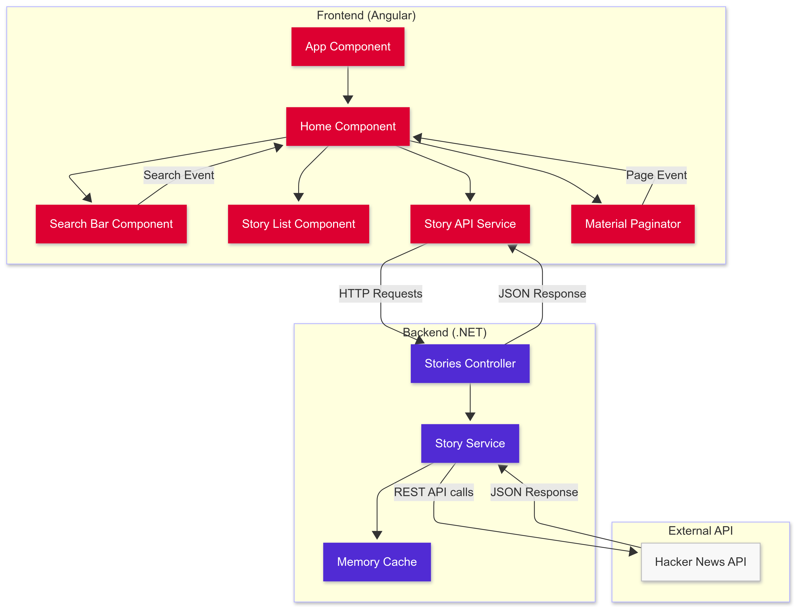

# Nextech Coding Challenge
 What Is This Project?
---------------------

This is a full-stack application for a coding challenge for Nextech to browse the newest stories from Hacker News. It consists of two parts:

<details>
<summary>Hacker News API - Backend Challenge</summary>
===================================

Overview
--------

This project is a .NET 8.0 web API that provides an interface to fetch the newest stories from Hacker News. It acts as a wrapper around the official Hacker News API, providing pagination capabilities and caching to improve performance.

Features
--------

-   Fetch the newest stories from Hacker News with pagination support
-   Memory caching of story IDs to reduce API calls
-   Swagger UI for API documentation and testing
-   Comprehensive unit tests

Prerequisites
-------------

-   [.NET 8.0 SDK](https://dotnet.microsoft.com/download/dotnet/8.0)
-   Visual Studio 2022 or Visual Studio Code (optional, for development)

Getting Started
---------------

### Clone the Repository

```
git clone https://github.com/MrDuise/Nextech-Coding-Challenge
cd BackendChallenge

```

### Build and Run Locally

#### Using .NET CLI

```
# Navigate to the project directory
cd "BackendChallenge"

# Restore dependencies
dotnet restore

# Build the project
dotnet build

# Run the application
dotnet run

```

The API will be available at `http://localhost:5037` by default.

#### Using Visual Studio

1.  Open the solution file `Backend Challenge.sln` in Visual Studio
2.  Press F5 or click the "Start" button to build and run the project


API Documentation
-----------------

Once the application is running, you can access the Swagger UI at:

-   Local Development: `http://localhost:5037/swagger`

### Available Endpoints

#### GET /api/Stories

Fetches a paginated list of newest stories from Hacker News.

**Parameters:**

-   `amount` (int): Number of stories per page
-   `page` (int): Page number (starting from 1)

**Returns**

- 

**Example:**

```
GET /api/Stories?amount=10&page=1

```


Testing
-------

### Running Unit Tests

```
# Navigate to the project directory
cd "Backend Challenge"

# Run the tests
dotnet test

```

### Manual Testing

You can manually test the API using:

1.  **Swagger UI**: Navigate to the Swagger UI endpoint after starting the application
2.  **Curl**:

    ```
    curl -X GET "http://localhost:5037/api/Stories?amount=10&page=1" -H "accept: application/json"

    ```

3.  **Postman or similar API testing tool**

Implementation Details
----------------------

-   The application uses RestSharp to communicate with the Hacker News API
-   Stories are cached for 5 minutes to reduce the load on the Hacker News API
-   Error handling is implemented at multiple levels to ensure a robust application

Troubleshooting
---------------

If you encounter any issues:

1.  Ensure the Hacker News API is accessible (https://hacker-news.firebaseio.com/)
2.  Check application logs for detailed error information
3.  Verify your network connection if running in Docker


</details>
<details>
<summary>Hacker News API - Frontend Challenge</summary>
================================

Overview
--------

This is an Angular-based frontend application that displays the newest stories from Hacker News. The application connects to a backend API to fetch stories, provides pagination functionality, and includes search capabilities.

Features
--------

-   Browse newest Hacker News stories with a clean, card-based UI
-   Paginate through stories with a configurable page size
-   Search functionality to filter stories by keyword
-   Responsive design using Angular Material components
-   Comprehensive unit tests

Prerequisites
-------------

-   [Node.js](https://nodejs.org/) (v16 or later)
-   [Angular CLI](https://angular.io/cli) (`npm install -g @angular/cli`)
-   Backend API running on `http://localhost:5037` (or configured URL)

Project Structure
-----------------

```
frontend-app/
├── src/
│   ├── app/
│   │   ├── components/
│   │   │   ├── search-bar/
│   │   │   └── story-list/
│   │   ├── models/
│   │   ├── pages/
│   │   │   └── home/
│   │   └── services/
│   │       └── story-api/
│   ├── assets/
│   └── environments/
├── package.json

```

Getting Started
---------------

### Installation

```
# Clone the repository (if you haven't already)
git clone https://github.com/MrDuise/Nextech-Coding-Challenge
cd Nextech-Coding-Challenge/frontend-app

# Install dependencies
npm install

```

### Running the Application

```
# Start the development server
ng serve

# Alternatively, to specify a port
ng serve --port 4200

```

The application will be available at `http://localhost:4200` by default.

### Configuration

### Connecting to a Local Backend for Development

By default, the application is configured to use the Azure-hosted backend:


`{ provide: API_BASE_URL, useValue: 'https://nextechbackendchallenge-gebgfjh6arh6a5g3.westus-01.azurewebsites.net/api' }`

For local development, update the `API_BASE_URL` in `src/app/app.config.ts` to point to your local backend:


`{ provide: API_BASE_URL, useValue: 'http://localhost:5037/api' }`

> **Note:** If your local backend is running on a different port or URL, be sure to update the `API_BASE_URL` accordingly.

Usage
-----

-   **Browse Stories**: The main page displays the newest stories from Hacker News
-   **Pagination**: Use the paginator at the bottom to navigate between pages
-   **Change Page Size**: Select different page sizes (5, 10, 25, 100) from the paginator
-   **Search**: Enter keywords in the search bar and press Enter or click the search icon
-   **Clear Search**: After searching, a "Clear Search" button appears to return to all stories

Components
----------

### App Component

The root component that serves as the entry point for the application.

### Home Component

The main page component that orchestrates:

-   Story fetching
-   Pagination
-   Search functionality
-   Displaying results

### Search Bar Component

A reusable component that:

-   Provides a Material Design search input
-   Emits search events to the parent component

### Story List Component

Displays the stories as cards with:

-   Title and author information
-   Link to the original story
-   Loading spinner when fetching data

Services
--------

### Story API Service

Handles communication with the backend API:

-   `getNewStories(amount, page)`: Fetches paginated stories
-   `searchStories(query)`: Searches for stories matching the query

Testing
-------

The application includes comprehensive unit tests for all components and services.

```
# Run unit tests
ng test

# Run tests with code coverage report
ng test --code-coverage

```

### Key Test Cases

-   Component creation and initialization
-   API service calls and responses
-   Pagination functionality
-   Search behavior
-   UI state management

Building for Production
-----------------------

```
# Build the application for production
ng build --configuration production

```

The build artifacts will be stored in the `dist/` directory.

Troubleshooting
---------------

### Common Issues

1.  **API Connection Errors**: Ensure the backend API is running and accessible at the configured URL.

2.  **CORS Issues**: If you see CORS errors in the console, ensure the backend API has CORS configured to allow requests from your frontend origin.

3.  **Material Component Errors**: Make sure all Angular Material dependencies are correctly installed and imported.

</details>

Key Features
------------

-   Browse newest Hacker News stories with pagination
-   Search functionality to filter stories
-   Responsive card-based UI using Angular Material
-   Efficient backend caching to reduce API calls to Hacker News
-   Hosted on Azure [Click Here](https://white-bush-0088b851e.6.azurestaticapps.net/)

Technical Implementation Decisions

Component Flowchart

---

Class Diagram

---
### Development Process
I drew the first image on a whiteboard first, just to get my idea on paper of how to structure this app. 
Once I had that, I converted it to a slighly less detailed class diagram then the one included. I wasn't given a firm time limit, so I figured detail mattered.
After I created these to guide my development, I started with the backend. I almost always start there, as its what I like better. Due to such a detailed plan, development went pretty smoothly. I 
did have a few issues making the list spinner load correctly, and had some issues with the search component and passing the values in. 
Orginally I wanted to have a more complex way of managing those values instead of passing from parent to child, using an event driven system, but I decied that just passing the values was simpliest. 
The hardest part of all these was getting the tests working, which is why I only have happy path, and getting the azure pipeline to work.
### Backend Implementation

-   **In-Memory Caching**: Used .NET's built-in memory cache instead of more complex solutions like Redis. This approach provides sufficient performance for the application's needs while keeping the architecture simple and deployment straightforward.
-   **RestSharp vs HttpClient**: Implemented API calls using RestSharp instead of the built-in HttpClient. While HttpClient is more lightweight, RestSharp provides a more testable interface, making it easier to write unit tests with mocking capabilities.
-   **Server-Side Pagination**: Pagination is handled on the backend rather than fetching all story IDs at once. This approach significantly reduces the payload size and number of API calls needed from the client, improving performance and user experience.
-   **Error Handling**: Implemented comprehensive exception handling to gracefully manage API failures and return appropriate status codes.

### Frontend Implementation

-   **Component-Based Architecture**: Separated the UI into reusable components (search bar, story list) for better maintainability.
-   **Angular Material**: Used Material Design components to create a clean, professional user interface with minimal custom CSS.
-   **Client-Side Search Pagination**: Once search results are fetched, pagination is handled client-side to reduce unnecessary server calls.


### Infrastructure

-   I set up CI/CD pipelines for automated testing and deployment, running in main.yml
- There are 4 jobs, tests run first for front-end and backend, then the deploy stages once tests pass

Future Improvements if I had more time
-------------------

### Backend Enhancements
-   Add endpoints for fetching comments and user profiles
  - Expanded and clearer logging system
-   Implement API rate limiting to prevent abuse, expecaly with it hosted
-   Optimize search functionality with a dedicated search engine (e.g., Elasticsearch)

### Frontend Enhancements if I had more time

-   Expand unit testing to cover error paths and edge cases
-   Add UI/integration testing with Cypress or Playwright
-   Clean up the UI, it looks ok, but could be better, its dull
  - Make the UI mobile friendly


Technical Debt and Known Limitations
------------------------------------

-   Frontend unit tests currently focus on happy paths only and need expansion
-   Limited error handling for network issues in the frontend
-   No comprehensive logging system implemented
-   Lacks sophisticated monitoring for production use
-   Search functionality is basic and could be improved with more advanced filtering options
  - backend api is slow due to basic teir of Azure

Conclusion
----------

- Time spent coding: 6 hours
- Time spent fixing bugs and configs: 7 hours

